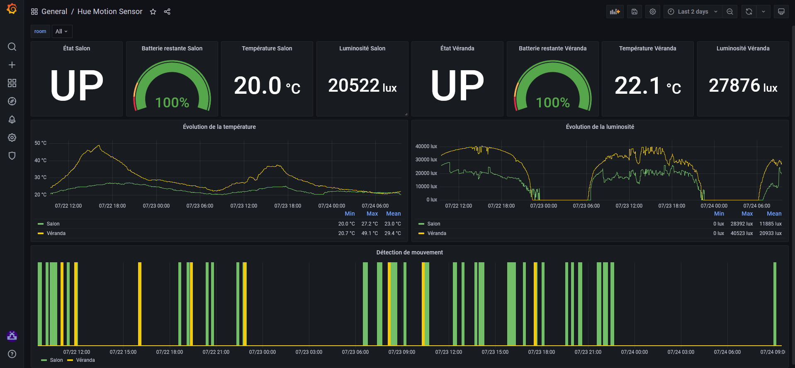

# Hue Motion Sensor Exporter

## Description

Exporter Prometheus des indicateurs (présence, luminosité, température, ...) remontés par le détecteur de mouvement Philips Hue.

## Variable d'environement

| Variable d'environement             | Description                          | Valeur par défaut        |
|-------------------------------------|--------------------------------------|--------------------------|
| HUE_MOTION_SENSOR_EXPORTER_LOGLEVEL | Niveau de verbosité de l'exporter    | INFO                     |
| HUE_MOTION_SENSOR_EXPORTER_NAME     | Valeur 'job' des métriques remontées | dockerhub-limit-exporter |
| HUE_MOTION_SENSOR_EXPORTER_PORT     | Port d'écoute de l'exporter          | 8123                     |
| HUE_USERNAME                        | Utilisateur Hue Bridge               | Vide                     |
| HTTP_PROXY                          | Proxy HTTP                           | Vide                     |
| HTTPS_PROXY                         | Proxy HTTPS                          | Vide                     |

## Format des métriques

Les métriques remontées par l'exporter sont toutes préfixées par la chaine de caractère : **'hue_motion_sensor_'**.

```bash
# HELP hue_motion_sensor_presence Présence (1: OUI, 0: NON)
# TYPE hue_motion_sensor_presence gauge
hue_motion_sensor_presence{job="hue-motion-sensor-exporter",room="Salon"} 0.0
# HELP hue_motion_sensor_battery Batterie restante en %
# TYPE hue_motion_sensor_battery gauge
hue_motion_sensor_battery{job="hue-motion-sensor-exporter",room="Salon"} 100.0
# HELP hue_motion_sensor_state Etat (1: ON, 0: OFF)
# TYPE hue_motion_sensor_state gauge
hue_motion_sensor_state{job="hue-motion-sensor-exporter",room="Salon"} 1.0
# HELP hue_motion_sensor_lightlevel Luminosité en lx
# TYPE hue_motion_sensor_lightlevel gauge
hue_motion_sensor_lightlevel{job="hue-motion-sensor-exporter",room="Salon"} 8552.0
# HELP hue_motion_sensor_temperature Température en °C
# TYPE hue_motion_sensor_temperature gauge
hue_motion_sensor_temperature{job="hue-motion-sensor-exporter",room="Salon"} 1833.0
```

## Lancement de l'exporter

L'exporter est "packagé" sous forme de conteneur Docker.

Une fois le conteneur construit, il peut être lancé comme suit :

`docker run -dit -p 8123:8123 hue-motion-sensor-exporter`

L'association "Pièce/Détecteur de mouvement" se fait en alimentant la variable **HUE_MOTION_SENSORS** (liste de dictionnaires) du fichier **hue_motion_sensor_exporter.py** :

Exemple :

```bash
HUE_MOTION_SENSORS = [
    {'uniqueid': '00:17:88:01:04:b6:e5:df-02-04', 'room': 'Salon'}
]
```

## Tableau de bord Grafana

Un tableau de bord Grafana est disponible dans le répertoire **grafana** et permet l'exploitation des métriques remontées par l'exporter.

_Capture d'écran :_


